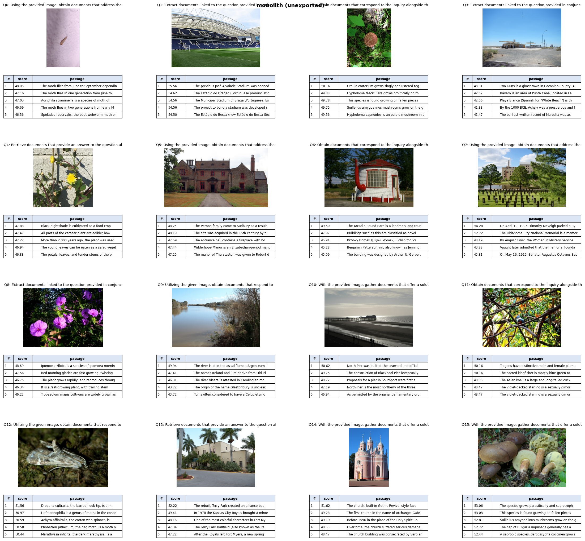

# VortexSplit

Auto-segment PreFLMR's `query()` into profiled, exportable components and run retrieval through the split model.

## Requirements

- **[uv](https://docs.astral.sh/uv/)** for dependency management
- **NVIDIA GPU + CUDA 11.8**
- **Graphviz** (`dot` on your `PATH`) 

## Install

```bash
uv sync
uv run python main.py --help
```

## Data

Retrieval needs the EVQA (M2KR) text, passages, and query images. Fetch them with:

```bash
uv run python fetch_datasets.py
```

A prebuilt ColBERT index is expected under `/data/EVQA/index` (see the paths in
[main.py](main.py): `INDEX_ROOT`, `EXPERIMENT`, `INDEX_NAME`).

## Workflow

```bash
HF_HUB_OFFLINE=1 uv run python main.py generate --batch 16 --out /dev/shm/flmr_split.tspart --coarse
HF_HUB_OFFLINE=1 uv run python main.py demo --artifact /dev/shm/flmr_split.tspart --batch 16
HF_HUB_OFFLINE=1 uv run python main.py draw --artifact /dev/shm/flmr_split.tspart --out flow.svg
```

## Tests
```bash
uv run pytest
uv run pytest -m slow
```

## Example
Identical results between monolith and partitioned

baseline



partitioned

